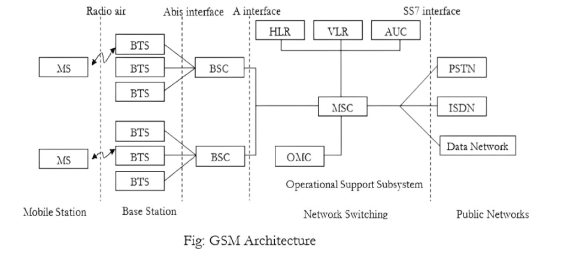

# 📡 GSM Architecture

The GSM architecture is divided into three main subsystems:

---

## 1. 📱 Mobile Station (MS)
- **Components**:
  - **Mobile Equipment (ME)**: The handset used by the subscriber.
  - **SIM (Subscriber Identity Module)**: A smart card that stores user identity, authentication keys, and subscriber data.
- **Function**: Communicates with the BTS over the **radio interface**.

---

## 2. 🛰️ Base Station Subsystem (BSS)

### a) Base Transceiver Station (BTS)
- Interfaces directly with the mobile station.
- Handles radio transmission and reception.
- Converts signals between analog (radio) and digital.

### b) Base Station Controller (BSC)
- Controls multiple BTSs.
- Manages handovers, frequency allocation, and power control.
- Connects to the MSC using the **A interface**.

**Interface Details:**
- **Radio interface**: Between MS and BTS.
- **Abis interface**: Between BTS and BSC.
- **A interface**: Between BSC and MSC.

---

## 3. 🧠 Network Switching Subsystem (NSS)

### a) Mobile Switching Center (MSC)
- Core of the network switching.
- Routes calls and SMS.
- Handles mobility management and call setup.

### b) Home Location Register (HLR)
- Central database containing permanent subscriber info like plan, services, etc.

### c) Visitor Location Register (VLR)
- Temporary database for roaming users in the current MSC area.

### d) Authentication Center (AUC)
- Verifies user identity using encryption and challenge-response.

### e) Equipment Identity Register (EIR) *(not shown in image but part of NSS)*
- Maintains list of allowed/blocked mobile equipment based on IMEI.

---

## 4. 🛠 Operational Support Subsystem (OSS)

### a) Operation and Maintenance Center (OMC)
- Manages network operations, faults, and performance.
- Interfaces with MSC, BSC, and other nodes for administrative control.

---

## 5. 🌐 Public Network Interfaces

### a) PSTN (Public Switched Telephone Network)
- Allows GSM users to make calls to landline phones.

### b) ISDN (Integrated Services Digital Network)
- Supports voice, video, and data services.

### c) Data Networks
- Provides connectivity to internet and data services.

**SS7 Interface**: Used for signaling between MSC and external networks like PSTN and ISDN.

---

## 🔁 Summary of Interfaces

| Interface     | Between              | Purpose                          |
|---------------|----------------------|----------------------------------|
| **Um (Radio)**| MS ↔ BTS              | Wireless communication           |
| **Abis**      | BTS ↔ BSC             | Manages BTS                     |
| **A**         | BSC ↔ MSC             | Switch control and handover     |
| **SS7**       | MSC ↔ Public Networks | Signaling & external connectivity|

---
