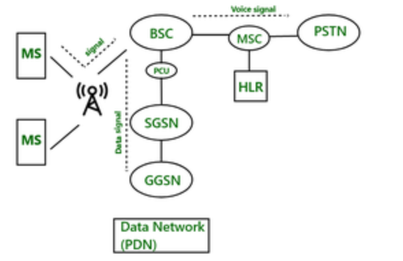

Let's break down this GPRS architecture diagram piece by piece, explaining how it enables mobile devices to connect to data networks.

**The Core Idea: Adding Packet Data to GSM**

GPRS (General Packet Radio Service) is essentially an extension of the existing GSM (Global System for Mobile Communications) network. Its primary goal is to provide packet-switched data services in addition to GSM's circuit-switched voice services. Think of it like adding a separate lane for internet traffic on a highway primarily built for cars.

**Key Components and Their Roles:**

1.  **MS (Mobile Station):**
    * This represents your mobile phone or any other device that can connect to the GSM/GPRS network.
    * It communicates wirelessly with the base station (represented by the antenna).
    * It can send and receive both voice signals (for calls) and data signals (for internet access, etc.).

2.  **((o))) / A (Base Transceiver Station - BTS):**
    * This is the radio equipment (antenna and transceivers) at a cell site that communicates directly with the Mobile Stations.
    * It transmits and receives radio signals.
    * In a GPRS context, the BTS handles both voice and data traffic from the MS.

3.  **BSC (Base Station Controller):**
    * The BSC manages one or more BTSs.
    * It's responsible for radio resource management (allocating channels, handover control), and in the context of GPRS, it plays a role in routing data to the appropriate GPRS core network elements.

4.  **PCU (Packet Control Unit):**
    * This is a crucial component specifically for GPRS. It's often integrated within the BSC but can also be a separate entity.
    * **Its main function is to separate voice and data traffic coming from the BTS.**
    * It directs voice traffic to the MSC (Mobile Switching Center) and data traffic to the SGSN (Serving GPRS Support Node).

5.  **SGSN (Serving GPRS Support Node):**
    * This is a key node in the GPRS core network.
    * **It's responsible for:**
        * Packet routing and transfer.
        * Mobility management (keeping track of the location of mobile stations).
        * Security functions (authentication and authorization).
        * Session management (establishing and maintaining data connections).
        * Collecting charging information for data usage.
    * The SGSN communicates with the BSC (via the PCU) and the GGSN.

6.  **GGSN (Gateway GPRS Support Node):**
    * This is another vital node that acts as a gateway between the GPRS network and external packet data networks (PDNs), like the internet.
    * **Its main functions are:**
        * IP address assignment to mobile stations.
        * Routing of data packets between the SGSN and the PDN.
        * Security functions (firewalling, filtering).
        * Serving as the point of charging for external data network access.

7.  **Data Network (PDN):**
    * This represents any external packet-switched network that the mobile device wants to connect to, most commonly the internet.

**Elements Primarily for Voice (but shown for context):**

* **MSC (Mobile Switching Center):** This is the central switching node for the circuit-switched voice network. It handles call setup, routing, and termination. Voice signals from the BSC are directed here.
* **HLR (Home Location Register):** This is a central database containing permanent subscriber information, including their service profile and current location. The MSC queries the HLR for call routing and subscriber information.
* **PSTN (Public Switched Telephone Network):** This represents the traditional landline telephone network. The MSC connects the mobile network to the PSTN for calls to and from landline phones.

**Data Flow:**

1.  When a Mobile Station wants to access data services (e.g., browse the internet), the data is transmitted wirelessly to the BTS.
2.  The BTS forwards this signal to the BSC.
3.  The **PCU** within the BSC (or connected to it) recognizes this as data traffic and directs it to the **SGSN**.
4.  The **SGSN** handles authentication, security, and mobility management for the MS. It then forwards the data packets to the appropriate **GGSN**.
5.  The **GGSN** acts as a gateway and routes the data packets to the target **Data Network (PDN)**.
6.  Return traffic from the PDN follows the reverse path: GGSN $\rightarrow$ SGSN $\rightarrow$ BSC (via PCU) $\rightarrow$ BTS $\rightarrow$ MS.

**In Summary:**

The GPRS architecture overlays a packet-switched network on top of the circuit-switched GSM network. The key enabling components for data services are the PCU (for traffic separation), the SGSN (for mobility and session management), and the GGSN (for gateway functionality to external data networks). This architecture allowed mobile users to access the internet and other data services using their mobile phones, paving the way for modern mobile internet usage.