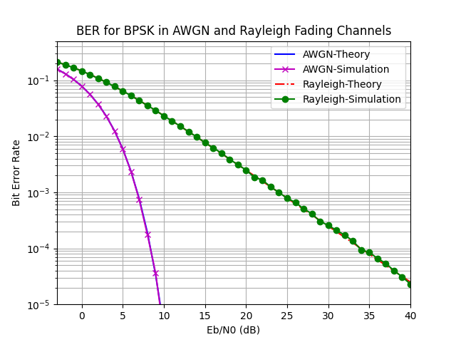

# BPSK BER Simulation over AWGN and Rayleigh Fading Channels

This project simulates the Bit Error Rate (BER) performance of Binary Phase Shift Keying (BPSK) modulation over two types of communication channels:
- Additive White Gaussian Noise (AWGN) Channel
- Rayleigh Fading Channel

Both theoretical and simulated BER curves are plotted and compared.

## Overview

- **Modulation**: BPSK (Binary Phase Shift Keying)
- **Channels**: 
  - AWGN
  - Rayleigh Fading
- **Performance Metrics**: BER (Bit Error Rate) vs. \( E_b/N_0 \) (Energy per bit to Noise Power Spectral Density Ratio)
- **Visualizations**: Plots saved as `awgn.png` and `ray.png`

## Files

- `simulate_ber_bpsk.py` - The main Python simulation code.
- `awgn.png` - BER plot for AWGN channel.
- `ray.png` - BER plot for Rayleigh fading channel.
- `README.md` - This documentation.

## How It Works

1. **Bit Generation**  
   Random bits are generated for transmission.

2. **BPSK Modulation**  
   Bits are mapped to BPSK symbols:  
   \[
   0 \rightarrow -1, \quad 1 \rightarrow +1
   \]

3. **Noise Generation**  
   Complex Gaussian noise is generated.

4. **Signal Transmission**
   - **AWGN**: Noise is added directly to the BPSK symbols.
   - **Rayleigh**: Symbols are also multiplied by random Rayleigh fading coefficients before adding noise.

5. **Detection and BER Calculation**
   - For AWGN: Hard decision on the received signal’s real part.
   - For Rayleigh: Channel compensation (dividing received signal by fading coefficients) before hard decision.
   - BER is calculated by comparing detected bits with original bits.

6. **Plotting**  
   BER vs \( E_b/N_0 \) is plotted for both theory and simulation.

## Requirements

- Python 3.x
- numpy
- matplotlib
- scipy

Install the dependencies:

```bash
pip install numpy matplotlib scipy
```

## Running the Simulation

Run the Python script:

```bash
python simulate_ber_bpsk.py
```

It will generate BER performance plots and show them.

## Outputs

- **AWGN Channel BER** (Saved as `awgn.png`)  
  

- **Rayleigh Fading Channel BER** (Saved as `ray.png`)  
  

The plot shows:
- Theoretical and simulated BER curves for both AWGN and Rayleigh fading conditions.
- How BER improves with increasing \( E_b/N_0 \).
- The steeper slope for AWGN compared to Rayleigh, indicating better performance in AWGN channels.

## Theory

- **AWGN Channel BER** (BPSK):
  \[
  P_b = \frac{1}{2} \text{erfc}\left(\sqrt{\frac{E_b}{N_0}}\right)
  \]
- **Rayleigh Channel BER** (BPSK):
  \[
  P_b = \frac{1}{2}\left(1 - \sqrt{\frac{E_b/N_0}{1 + E_b/N_0}}\right)
  \]

## License

This project is provided for educational and research purposes.
