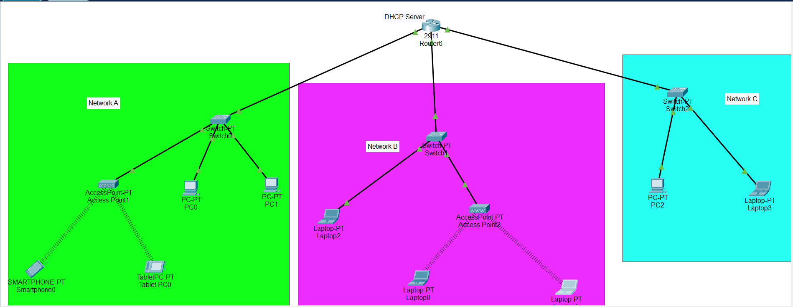

# 📡 DHCP Configuration using Cisco Router

## 🌐 Network Topology



- **Gi0/0** → LAN 1 → `192.168.1.0/24`
- **Gi0/1** → LAN 2 → `192.168.2.0/24`
- **Gi0/2** → LAN 3 → `192.168.3.0/24`

Each LAN is served by the router acting as the **DHCP Server**.

---

## 📖 Project Overview

In this project, we configured a **Cisco 2911 Router** to act as a **DHCP Server**, dynamically assigning IP addresses to devices connected across three different LANs.

The router is responsible for:
- Assigning IP addresses dynamically.
- Acting as the **default gateway**.
- Providing DNS server settings.

---

## ⚙️ Equipment Details

- **Device**: Cisco CISCO2911/K9 Router
- **Memory**: 491520K/32768K
- **Interfaces**: 3 × Gigabit Ethernet ports
- **Flash Storage**: 249MB ATA System CompactFlash

---

## 🛠 Configuration Steps

### 1. Interface IP Address Configuration

```plaintext
Router> enable
Router# config terminal

Router(config)# interface gigabitEthernet 0/0
Router(config-if)# ip address 192.168.1.1 255.255.255.0
Router(config-if)# no shutdown

Router(config)# interface gigabitEthernet 0/1
Router(config-if)# ip address 192.168.2.1 255.255.255.0
Router(config-if)# no shutdown

Router(config)# interface gigabitEthernet 0/2
Router(config-if)# ip address 192.168.3.1 255.255.255.0
Router(config-if)# no shutdown
```

✅ All interfaces were brought **up** successfully.

---

### 2. DHCP Pool Configuration

```plaintext
Router(config)# ip dhcp pool MYLAN1
Router(dhcp-config)# network 192.168.1.0 255.255.255.0
Router(dhcp-config)# default-router 192.168.1.1
Router(dhcp-config)# dns-server 8.8.8.8
Router(dhcp-config)# exit

Router(config)# ip dhcp pool MYLAN2
Router(dhcp-config)# network 192.168.2.0 255.255.255.0
Router(dhcp-config)# default-router 192.168.2.1
Router(dhcp-config)# dns-server 8.8.8.8
Router(dhcp-config)# exit

Router(config)# ip dhcp pool MYLAN3
Router(dhcp-config)# network 192.168.3.0 255.255.255.0
Router(dhcp-config)# default-router 192.168.3.1
Router(dhcp-config)# dns-server 8.8.8.8
Router(dhcp-config)# exit
```

---

### 3. DHCP Excluded Addresses

**Important**: Excluded addresses prevent critical IPs (e.g., router's own IP) from being assigned to clients.

```plaintext
Router(config)# ip dhcp excluded-address 192.168.1.1
Router(config)# ip dhcp excluded-address 192.168.2.1
Router(config)# ip dhcp excluded-address 192.168.3.1
```

> ❗ Multiple networks **cannot** be excluded in a single line. Each exclusion must be separate.

---

## 🧠 DORA Process Explained (DHCP Working)

The **DORA** process explains how DHCP assigns IP addresses dynamically:

| Step  | Description |
|------|-------------|
| **D** | **Discover**: The client broadcasts to find available DHCP servers. |
| **O** | **Offer**: The DHCP server responds with an IP address offer. |
| **R** | **Request**: The client requests the offered IP address. |
| **A** | **Acknowledgment**: The DHCP server sends a final confirmation, and the client configures itself with the assigned IP. |

✅ This 4-step handshake ensures clients receive valid IP configurations without conflicts.

---


## 📜 Final Output

After configuration:

- Clients in LAN 1 receive IPs like `192.168.1.X`
- Clients in LAN 2 receive IPs like `192.168.2.X`
- Clients in LAN 3 receive IPs like `192.168.3.X`
- All clients use the router IP as their **Default Gateway** and **8.8.8.8** as the **DNS Server**.

